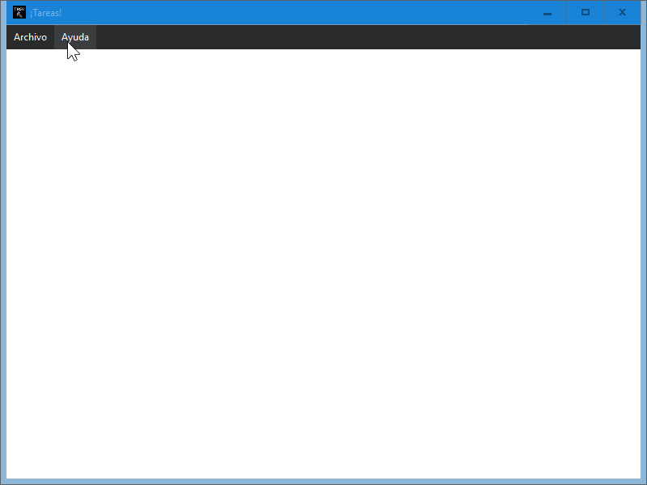

## Task-Admin-Sciter

This is exactly the same as [this](https://github.com/beto-bit/Task-Admin), except cloned using [Sciter](https://sciter.com) instead of Electron.

## Preview

## Instructions

On Windows, run [scapp.exe](https://github.com/c-smile/sciter-sdk/blob/master/bin.win/x32/scapp.exe) inside this folder.

The corresponding binary for Mac and Linux can be found in `bin.osx` and `bin.lnx`, respectively.